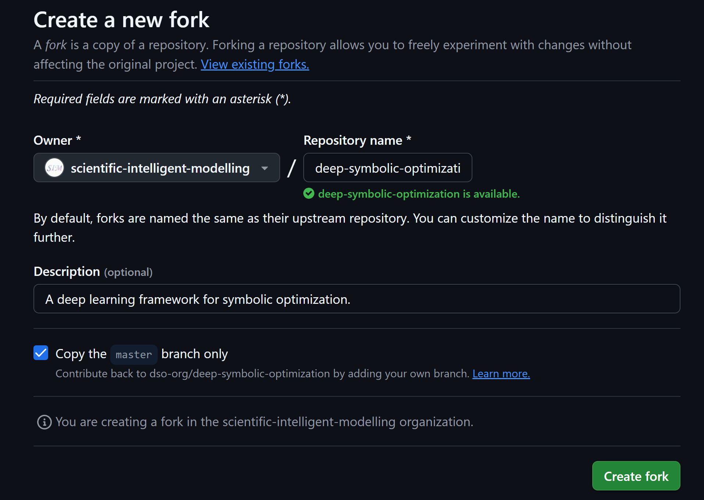

# 如何集成DSO(deep-symbolic-optimization)环境

## 环境测试（与之前的环境融合，这里先忽略这一步）

测试tpsr环境是否与之前的环境冲突，若冲突了，则需要新建一个新的环境，再集成进去

这里先不进行环境的测试，直接新建一个名为“tpsr”的环境

## 环境测试（测试能否在虚拟环境中跑通）

要把工具集成进去，第一步，就是得在自己的环境里面能够成功运行。

1、主仓库进行clone：

```bash
git clone https://github.com/ziwenhahaha/scientific-intelligent-modelling.git --recursive
cd scientific-intelligent-modelling
```

2、把子仓库进行添加submodule

2.1 fork到仓库中
把https://github.com/dso-org/deep-symbolic-optimization 进行fork到对应的organization里面
注意owner设置为scientific-intellgent-modelling


```bash
mkdir scientific_intelligent_modelling/algorithms/dso_wrapper
git submodule add https://github.com/scientific-intelligent-modelling/deep-symbolic-optimization.git scientific_intelligent_modelling/algorithms/dso_wrapper/dso
```

3、创建conda子环境：dso

```bash
conda create -n dso  python=3.7
conda activate dso
pip install -e scientific_intelligent_modelling/algorithms/dso_wrapper/dso/dso
```
