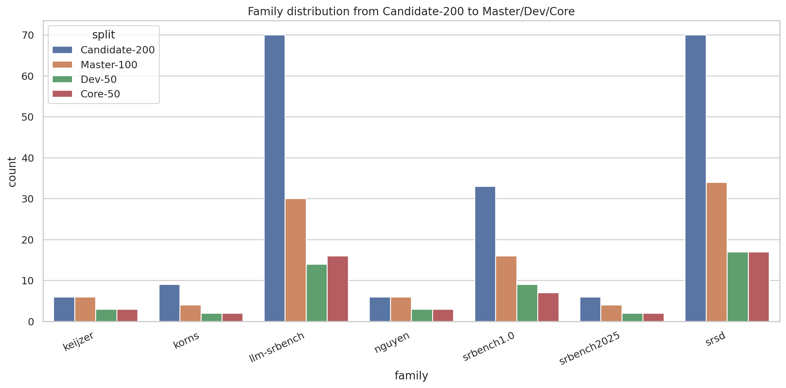
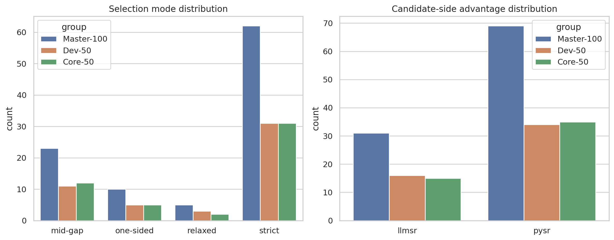
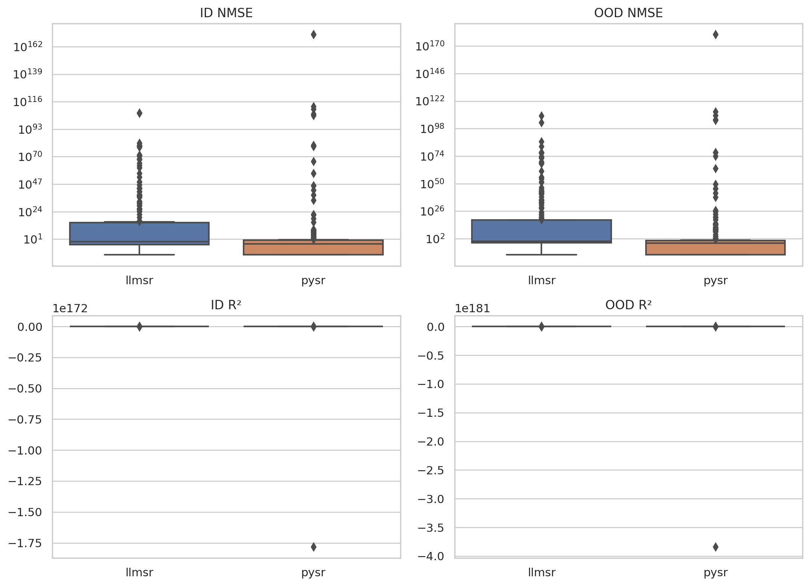
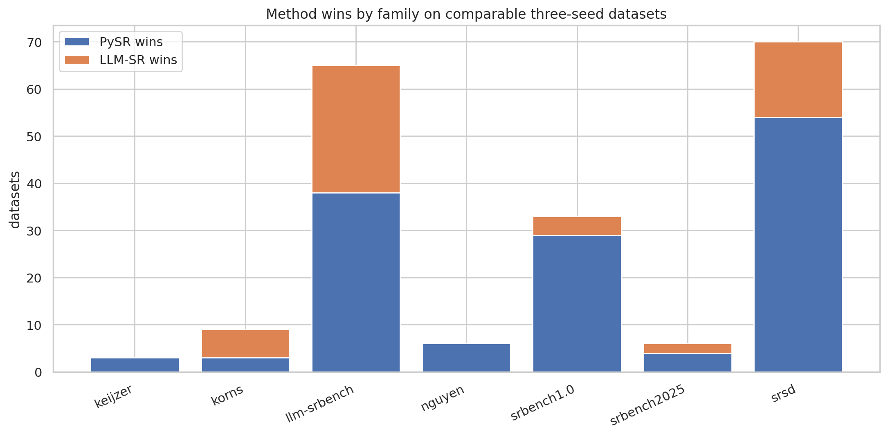

# Dev-50 / Core-50 切分说明（论文版简表）

## 设计原则

- 先基于三 seed 正式结果从 200 个候选中筛出 `Master-100`。
- 再只用非结果信息切分成 `Dev-50` 与 `Core-50`，避免直接按正式成绩量身定制测试集。
- 强约束：`Master-100` 内 `basename <= 1`，避免同 basename 变体跨集合泄漏。
- `Core-50` 中 `one-sided` 样本数限制为 `<= 5`。

## 为什么这样切

### 1. 这个切分要同时满足的两个目标

这次不是单纯做一个 `Top-100` 排名，而是同时满足两个目标：

1. **题要选得好**
   - 从 `200` 个候选里保留更有区分度、覆盖更完整、正式三 seed 结果更可信的一批；
2. **测试集要切得干净**
   - 后续会在 `Dev-50` 上做进化，因此 `Core-50` 不能再按正式结果量身定制，否则会污染最终评测。

所以我们把问题拆成两步：

- **第一步：** 用正式结果选 `Master-100`
- **第二步：** 只用非结果信息，把 `Master-100` 切成 `Dev-50 / Core-50`

这就是这版方案的核心理由。

### 2. 为什么先从 200 压到 100

原始 `200` 个候选虽然已经比全量 `664` 小很多，但仍然存在三个问题：

1. **大族过重**
   - `srsd = 70`
   - `llm-srbench = 70`
   - 两个大族合起来已经占到 `140 / 200 = 70%`

2. **`strict` 样本过多**
   - `strict = 126`
   - 已经超过一半，若直接切 `50/50`，两个集合都会被高 gap 样本主导

3. **存在 basename 重复**
   - 原始 `200` 里有 `12` 组重复 `basename`
   - 最大重复次数为 `2`
   - 如果不先清理，后面 `Dev/Core` 很容易出现 dummy / hard / medium 兄弟样本跨集合

因此不能直接在 `200` 上切 `50/50`，必须先压成一个更干净的中间宇宙。

### 3. `Master-100` 是怎么选的

#### 3.1 选择原则

`Master-100` 阶段允许使用三 seed 正式结果，因为这一步本质上是在回答：

- **“哪些题值得进入最终 benchmark 宇宙？”**

这里看正式结果是合理的，因为这一步还不是最终测试切分。

具体做法是：

- 用正式三 seed 结果构造 `priority_score`
- 高分样本优先
- 同时施加这三类硬约束：
  1. family 配额
  2. `basename <= 1`
  3. subgroup 软上限

#### 3.1.1 正式实验结果到底起了什么作用

这里的三 seed 正式实验，不是“跑完之后顺手参考一下”，而是 `Master-100` 构建的**直接数据支撑**。

这批正式实验一共覆盖：

- `200 datasets × 3 seeds × 2 methods = 1200` 个任务

任务级状态显示：

- `LLM-SR`
  - `seed=520`: `194 ok`, `6 timed_out`
  - `seed=521`: `191 ok`, `9 timed_out`
  - `seed=522`: `192 ok`, `8 timed_out`
- `PySR`
  - `seed=520`: `200 timed_out`
  - `seed=521`: `200 timed_out`
  - `seed=522`: `200 timed_out`

这里 `PySR timed_out` 不能直接等同失败，因为在统一 1h 口径回填后，它仍然产出了大量可用结果。  
按 dataset-method 聚合后，三个 seed 都有完整 `id+ood` 指标的数量是：

- `LLM-SR = 196 / 200`
- `PySR = 136 / 200`

而在能够直接比较两种方法平均 `id/ood NMSE` 的 `192` 个数据集上，胜负分布是：

- `PySR` 胜：`137`
- `LLM-SR` 胜：`55`

这还不是最重要的，最重要的是这批实验给出了**可量化的性能画像**：

#### 方法级中位数指标（按 `dataset×method` 聚合）

- `PySR`
  - `id_nmse_mean` 中位数：`0.00126`
  - `ood_nmse_mean` 中位数：`0.01546`
  - `id_r2_mean` 中位数：`0.9952`
  - `ood_r2_mean` 中位数：`0.8810`

- `LLM-SR`
  - `id_nmse_mean` 中位数：`0.11494`
  - `ood_nmse_mean` 中位数：`0.77116`
  - `id_r2_mean` 中位数：`0.8030`
  - `ood_r2_mean` 中位数：`-0.1112`

这些数字说明两件事：

1. `PySR` 在这 200 个候选上整体更强，尤其是 `OOD` 表现明显更好；
2. `LLM-SR` 虽然整体更弱，但并不是“完全不行”，而是在一批特定题型上仍然能形成稳定优势。

#### family 级胜负分布

在 `192` 个可直接比较的数据集上：

- `srsd`
  - `PySR = 54`
  - `LLM-SR = 16`
- `llm-srbench`
  - `PySR = 38`
  - `LLM-SR = 27`
- `srbench1.0`
  - `PySR = 29`
  - `LLM-SR = 4`
- `korns`
  - `LLM-SR = 6`
  - `PySR = 3`

这组 family 级数字非常关键，因为它说明：

- `LLM-SR` 的优势不是随机噪声，而是集中出现在某些结构族里；
- `PySR` 的优势也不是单点爆发，而是在 `srsd / srbench1.0` 等族上具有系统性优势；
- 因此 `Master-100` 不能只按一个全局分数排序，而必须同时保留多个 family / subgroup。

这批结果告诉我们三件事：

1. **两种方法确实能把候选池拉开**
   - 不是所有题都“谁跑都差不多”
   - 否则没有必要再从 200 里压到 100

2. **正式结果比 probe 更可信**
   - 200 候选池是由 probe 筛出来的
   - 但真正决定哪些题值得进入最终 benchmark 宇宙，应该看三 seed 正式结果，而不是只看 probe gap

3. **`Master-100` 的作用是保留“正式实验已经证明有信息量”的题**
   - 有的题在 probe 阶段看起来平衡
   - 但正式三 seed 后胜负会明显偏向某一方法
   - 有的题虽然区分度高，但三 seed 稳定性差、覆盖差
   - 这些都应该影响它是否进入 `Master-100`

更直接地说，正式实验在 `Master-100` 里的作用不是抽象的“参考一下”，而是具体决定了下面三件事：

1. **哪些题被判定为“值得保留”**
   - 至少一方要在正式实验里表现出真实可用性，而不是两边都纯噪声

2. **哪些 family 不能被砍得太狠**
   - 例如 `llm-srbench` 虽然整体不如 `srsd` 数量多，但 `LLM-SR` 在其中赢了 `27` 个，说明这部分不能在压缩时被过度削弱

3. **为什么最终 `Master-100` 仍保留 `LLM-SR` 主场**
   - 如果完全顺着总体胜负 `137:55` 去做 top 排序，`Master-100` 会更偏 `PySR`
   - 现在保留 `31` 个 `LLM-SR` 优势样本，就是为了让最终 benchmark 宇宙里仍保留这些被正式实验证明存在真实偏置差异的题

因此，正式结果在这里的作用是：

- **决定哪些题进入 `Master-100`**

而不是：

- 决定某个题进 `Dev-50` 还是 `Core-50`

这条边界很关键：

- `Master-100` 可以结果驱动，因为它是在做 benchmark 选题；
- `Dev/Core` 不能再结果驱动，因为那一步是在切测试集。

#### 3.2 为什么是这组 family 配额

原始 `200` 的顶层 family 分布是：

- `srsd = 70`
- `llm-srbench = 70`
- `srbench1.0 = 33`
- `korns = 9`
- `keijzer = 6`
- `nguyen = 6`
- `srbench2025 = 6`

我们给 `Master-100` 设定的 family 目标是：

- `srsd = 34`
- `llm-srbench = 30`
- `srbench1.0 = 16`
- `nguyen = 6`
- `keijzer = 6`
- `korns = 4`
- `srbench2025 = 4`

这些数字不是拍脑袋来的，而是基于下面这个缩放逻辑：

- 对**大族**：
  - `srsd: 70 -> 34`，保留率 `48.6%`
  - `llm-srbench: 70 -> 30`，保留率 `42.9%`
  - `srbench1.0: 33 -> 16`，保留率 `48.5%`
  - 也就是大致“减半保留”，避免前 100 被大族吞掉

- 对**中小族**：
  - `keijzer: 6 -> 6`，保留率 `100%`
  - `nguyen: 6 -> 6`，保留率 `100%`
  - `srbench2025: 6 -> 4`，保留率 `66.7%`
  - `korns: 9 -> 4`，保留率 `44.4%`
  - 也就是尽量完整保留本来就不多的题型

这组配额的目的不是“严格按比例抽样”，而是：

- **压缩大族**
- **保住稀有族**
- **让最终 100 个样本仍然覆盖主要题型**

#### 3.3 为什么要全局 `basename <= 1`

这是为了防止结构泄漏，不是为了美观。

原始 `200` 个候选里：

- 有 `12` 组重复 `basename`
- 最大重复次数是 `2`

这些重复大多来自：

- `srsd` 里同一题的 `hard / hard_dummy / medium_dummy` 等变体

如果这些同 basename 变体分散到 `Dev` 和 `Core`，那么：

- 你虽然没有在 `Core-50` 上直接调参
- 但你在 `Dev-50` 上已经见过几乎同结构的题

这会直接削弱 `Core-50` 的独立性。

因此我们在整个 `Master-100` 上施加：

- **`basename <= 1`**

最终结果也确实满足：

- `Master-100` 中 `duplicate basename groups = 0`
- `max basename multiplicity = 1`

### 4. 为什么 `Master-100` 的 `selection_mode` 不是原始目标值

原始 `200` 的 `selection_mode` 是：

- `strict = 126`
- `mid-gap = 40`
- `relaxed = 14`
- `one-sided = 20`

最终 `Master-100` 实现成：

- `strict = 62`
- `mid-gap = 23`
- `relaxed = 5`
- `one-sided = 10`

这里很多人第一反应会是：

- “为什么不把 `strict/mid-gap/relaxed/one-sided` 配得更平均？”

答案是：**因为那样会和“去泄漏 + family 覆盖 + 高质量样本优先”直接冲突。**

`strict` 多，不是脚本失控，而是数据本身就更集中在 `strict`：

- 原始 `200` 里就有 `126` 个 `strict`
- 且高优先级样本大多也集中在 `strict`

如果硬把 `strict` 压得更低，就需要牺牲：

1. family 覆盖
2. `basename <= 1`
3. 或者高优先级样本本身

所以这版方案的取舍是：

- **优先守住 family 和 anti-leakage**
- `selection_mode` 接受“数据自然分布 + 质量优先”后的结果

### 5. 为什么 `Dev/Core` 切分时不能再看正式结果

这一步是整个方案最关键的地方。

如果在切 `Dev-50 / Core-50` 时继续使用：

- `priority_score`
- `three_seed_gap`
- `正式 OOD 指标`
- `final_advantage_side`

那 `Core-50` 就会变成：

- **按正式结果量身定制出来的测试集**

这对后面“在 `Dev-50` 上进化、在 `Core-50` 上评测”的设定是有污染的。

因此切分阶段明确只用**非结果信息**：

- `family`
- `subgroup`
- `selection_mode`
- `candidate_advantage_side`
- `basename`
- 特征维度
- train/valid/id/ood 样本量
- 静态公式复杂度

换句话说：

- `Master-100` 决定**题值不值得进来**
- `Dev/Core` 决定**题怎么干净地分开**

### 6. 为什么说 `Dev-50 / Core-50` 是“同分布”的

这里不是空口说“差不多”，而是有明确数据支撑。

#### 6.1 顶层 family 基本对齐

- `srsd = 17 / 17`
- `llm-srbench = 14 / 16`
- `srbench1.0 = 9 / 7`
- `nguyen = 3 / 3`
- `keijzer = 3 / 3`
- `korns = 2 / 2`
- `srbench2025 = 2 / 2`

也就是说：

- 最大差值只有 `2`
- 大族、中族、小族都没有明显偏到某一侧

#### 6.2 `selection_mode` 基本对齐

- `strict = 31 / 31`
- `mid-gap = 11 / 12`
- `relaxed = 3 / 2`
- `one-sided = 5 / 5`

这说明：

- 两边不仅来源接近
- 连候选样本在“高 gap / 中 gap / 单边可评估”这类角色上也接近

#### 6.3 候选阶段优势标签基本对齐

- `Dev-50`: `pysr = 34`, `llmsr = 16`
- `Core-50`: `pysr = 35`, `llmsr = 15`

差值只有 `1`。

所以两边并没有出现：

- 一边几乎全是 `pysr` 主场
- 一边几乎全是 `llmsr` 主场

#### 6.4 静态难度代理也基本对齐

- `feature_count`: `3.76 vs 3.62`
- `train_samples`: `24044.22 vs 23934.44`
- `ood_test_samples`: `4930.28 vs 4936.16`
- `formula_operator_count`: `220.92 vs 228.18`

这些量虽然不是最终性能，但它们是我们在不看正式结果前提下，能用来近似“问题复杂度”的最稳代理。

这四组数字都很接近，说明：

- 两边的输入维度
- 数据规模
- OOD 测试规模
- 静态公式复杂度

都没有明显偏差。

#### 6.5 `Core-50` 特别控制了 `one-sided`

我们额外加了：

- `Core-50 one-sided <= 5`

最终实现是：

- `Dev-50 one-sided = 5`
- `Core-50 one-sided = 5`

这样可以避免 `Core-50` 过度变成“稳定性 failure-mode 测试集”，而保留它作为综合 benchmark 的意义。

## 指标图与解释

下面这 4 张图对应了这次切分最核心的 4 个论点。

### 图 1：Candidate-200 → Master-100 → Dev/Core 的 family 缩放

这张图回答的是：

- **为什么不能直接在 200 个候选上随机切 50/50？**
- **为什么要先压到 `Master-100`？**

从图里可以直接看到：

- 原始 `200` 个候选里，`srsd` 和 `llm-srbench` 两大族明显过重；
- `Master-100` 阶段对大族做了收缩；
- `Dev-50` 与 `Core-50` 在大族和小族上的分配又基本对齐。

所以这张图支撑的是：

- **先做 family 级压缩，再做 matched split，是必要的。**

### 图 2：`selection_mode` 与候选阶段优势标签在 `Master/Dev/Core` 中的分布

这张图回答的是：

- **为什么 `Dev-50` 和 `Core-50` 可以认为是“角色接近”的两个集合？**

从图里可以看到：

- `strict` 在两边都是 `31`
- `mid-gap` 是 `11 / 12`
- `one-sided` 是 `5 / 5`
- `pysr / llmsr` 候选阶段优势标签也是 `34/16` vs `35/15`

所以这张图支撑的是：

- **两边并不是一个偏 `PySR` 主场、一个偏 `LLM-SR` 主场；**
- **它们在候选角色和方法偏向上是匹配的。**

### 图 3：200 候选上的正式三 seed 方法性能分布

这张图回答的是：

- **为什么 `Master-100` 必须看正式结果，而不能只看 probe？**

从图里可以看到：

- `PySR` 在 `ID/OOD NMSE` 上整体更低；
- `PySR` 的 `OOD R²` 分布也整体更高；
- `LLM-SR` 在部分样本上能做得不错，但整体 `OOD` 分布明显更弱。

这说明：

- 正式三 seed 结果已经给出了足够清晰的方法差异；
- `Master-100` 的构建应该以后验正式结果为主，而不是只以前置 probe gap 为主。

### 图 4：可直接比较数据集上的 family 级胜负分布

这张图回答的是：

- **为什么 `Master-100` 不能只按一个全局分数排序？**

从图里可以看到：

- `srsd` 与 `srbench1.0` 更偏向 `PySR`
- `llm-srbench` 里 `LLM-SR` 仍有大量真实胜利
- `korns` 甚至整体更偏向 `LLM-SR`

所以这张图支撑的是：

- **不同 family 对两种方法的偏好并不一致；**
- **如果只按全局排序，`LLM-SR` 主场 family 很容易被过度削弱；**
- **因此 `Master-100` 必须带 family 配额，而不是单纯 top-k。**

## 集合规模

- `Master-100 = 100`
- `Dev-50 = 50`
- `Core-50 = 50`

## Master-100 顶层 family 分布

| family | 数量 |
|---|---:|
| `keijzer` | 6 |
| `korns` | 4 |
| `llm-srbench` | 30 |
| `nguyen` | 6 |
| `srbench1.0` | 16 |
| `srbench2025` | 4 |
| `srsd` | 34 |

### Dev/Core 顶层 family 分布

| 项目 | Dev-50 | Core-50 |
|---|---:|---:|
| `keijzer` | 3 | 3 |
| `korns` | 2 | 2 |
| `llm-srbench` | 14 | 16 |
| `nguyen` | 3 | 3 |
| `srbench1.0` | 9 | 7 |
| `srbench2025` | 2 | 2 |
| `srsd` | 17 | 17 |

### Dev/Core selection_mode 分布

| 项目 | Dev-50 | Core-50 |
|---|---:|---:|
| `mid-gap` | 11 | 12 |
| `one-sided` | 5 | 5 |
| `relaxed` | 3 | 2 |
| `strict` | 31 | 31 |

### Dev/Core 候选阶段优势标签分布

| 项目 | Dev-50 | Core-50 |
|---|---:|---:|
| `llmsr` | 16 | 15 |
| `pysr` | 34 | 35 |

## 静态属性匹配摘要

| 指标 | Dev-50 mean | Dev-50 median | Core-50 mean | Core-50 median |
|---|---:|---:|---:|---:|
| `feature_count` | 3.76 | 3.0 | 3.62 | 3.5 |
| `train_samples` | 24044.22 | 8000.0 | 23934.44 | 8000.0 |
| `valid_samples` | 2402.08 | 1000.0 | 2301.68 | 1000.0 |
| `id_test_samples` | 11971.32 | 1000.0 | 12152.7 | 1000.0 |
| `ood_test_samples` | 4930.28 | 1000.0 | 4936.16 | 1000.0 |
| `formula_operator_count` | 220.92 | 93.5 | 228.18 | 95.5 |

## 使用建议

- `Dev-50`：用于方法迭代、进化和超参选择。
- `Core-50`：冻结，不参与任何调参，只用于最终汇报。
- 两个集合分布尽量一致，但 `Core-50` 不再根据正式结果做二次微调。
